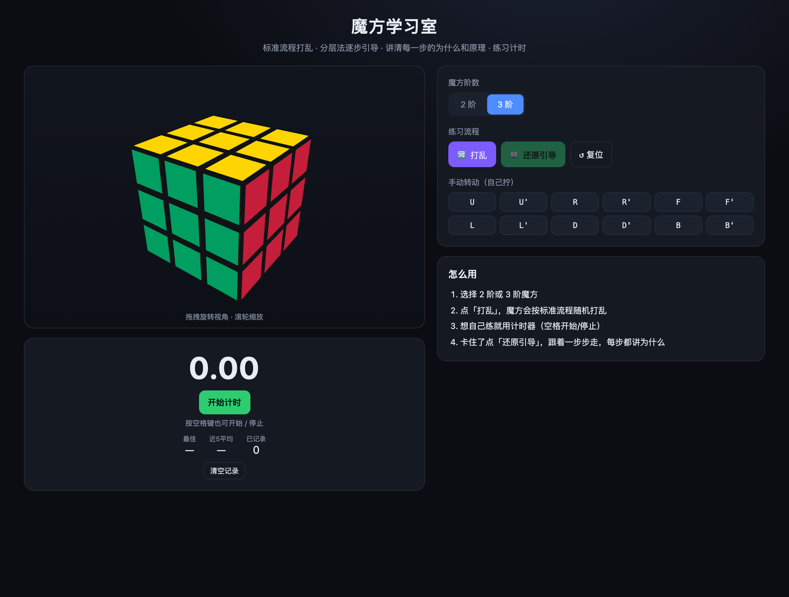
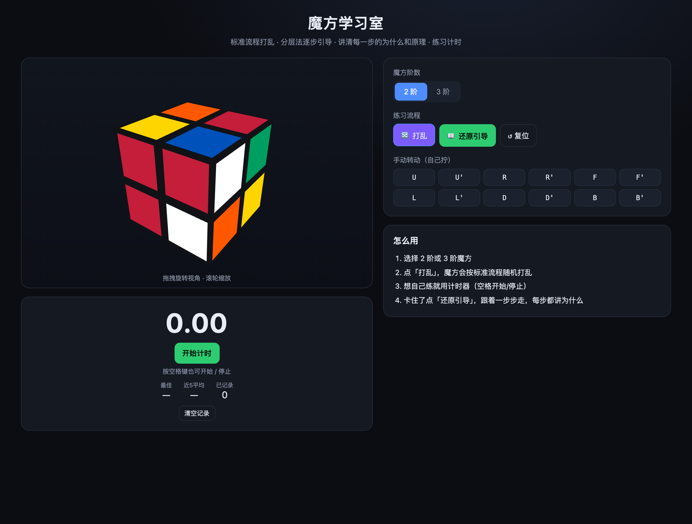

# 魔方学习室

一个用于平时练习的魔方 Web 应用：标准流程打乱 → 分层法逐步引导还原 → 每步讲清公式 / 为什么 / 原理，支持 **2 阶 / 3 阶** 切换，带 **计时器**。纯前端，无需后端。

## 界面预览

| 首页（3 阶还原态 + 使用说明） | 标准流程打乱 |
| :---: | :---: |
|  |  |

| 还原引导（公式 / 为什么 / 原理 / 阶段进度） | 2 阶魔方 |
| :---: | :---: |
|  |  |

## 运行

```bash
npm install
npm run dev      # 开发服务器 http://localhost:5173
npm run build    # 生产构建
npm test         # 运行测试
```

## 功能

- **3D 可交互魔方**（Three.js）：拖拽旋转视角、滚轮缩放、转层动画。
- **标准打乱**：WCA 风格 random-move，去除相邻/对面冗余（3 阶 ~20 步，2 阶 ~9 步）。
- **分层法引导还原**：
  - 3 阶七阶段：白十字 → 第一层角块 → 第二层棱块 → 顶层黄十字 → 顶面全黄 → PLL 排列 → 收尾。
  - 2 阶层先法：完成一层 → 顶面定向 → 顶层排列。
  - 每步显示：公式名 + WCA 记号 + 为什么这么做 + 原理。
- **计时器**：开始/停止（支持空格键），记录最佳成绩、近 5 次平均（ao5），localStorage 本地持久化。

## 架构

三层解耦：

```
src/
  cube/      魔方引擎：facelet 状态、几何推导的置换表、打乱、cubie 访问器、渲染映射
  solver/    分层求解器：受限生成元 IDA* 搜索（前两层）+ 具名公式宏搜索（最后一层）
  teaching/  教学文案（与求解逻辑解耦，按 caseId 查表）
  ui/        React + Three.js：3D 画布、控制面板、计时器、步骤引导
  __tests__/ 置换不变量 + 求解器收敛性 + 端到端教学包装测试
```

### 关键设计

1. **facelet 颜色数组是唯一状态来源**；cubie（块）视图为只读派生，避免双状态同步 bug。
2. **置换表全部由 3D 几何旋转推导**（按位置+法向量），而非手推索引，规避 B 面镜像列等易错点；用「move×4=identity」「X X'=id」「T-perm 自逆」等不变量测试锁死正确性。
3. **求解用目标导向而非盲搜**：前两层采用「每槽位受限生成元（U + 该槽 2 个侧面）+ insert-or-eject」，把搜索分支因子压到 ~6、深度 ≤8，单次求解 ~50ms；最后一层用具名公式（Sune / OLL / PLL）的宏搜索，保证收敛且每步有名字可讲。
4. **教学场景选分层法而非 Kociemba 最优解**：最优解每步无人类语义，无法生成「为什么」叙事；分层法每步对应直观子目标。

测试覆盖：3 阶 / 2 阶各数百次随机打乱 100% 还原。
